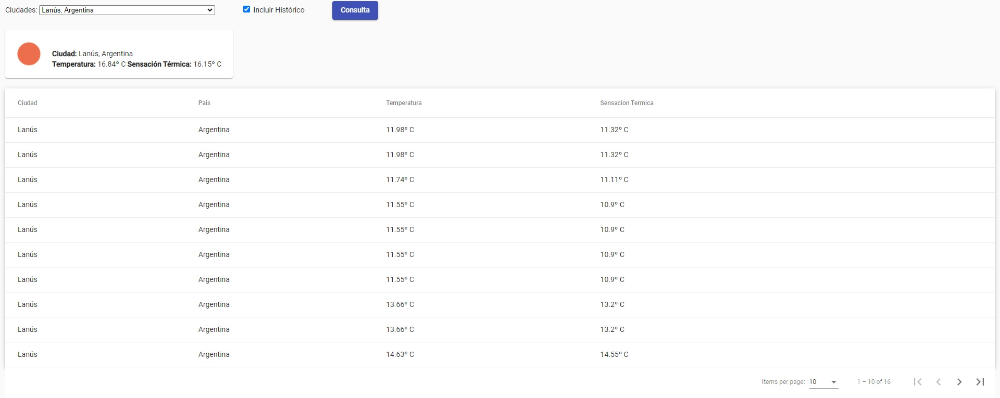

# Frontend AppClima Angular

Esta es la parte de frontend para app de consultas de clima, esta realizada en Angular.
Si encuentran algo que se pueda mejorar pueden decirme siempre estoy aprendiendo y mi conocimiento en Frontend no es muy amplio.
Gracias!



# App Clima
En la aplicación se puede consultar el clima de una ciudad, te muestra la temperatura y la sensación térmica del lugar en Celcius.
Posee una opción de incluir historico, la cual al estar hablilitada nos muestra una grilla con todas las consultas realizadas de la ciudad seleccionada.

# Configuración

Modificar el archivo **appsettings.json** que se encuentra en la carpeta config.
```JSON
{

	"UrlHistorico": "http://localhost:9096/api/historico",

	"UrlClima": "http://localhost:9096/api/clima",

	"UrlCiudad": "http://localhost:9096/api/ciudad"

}
```
Reemplazar **localhost:9096** por la dirección donde monten la parte de backend.

**Backend:** https://github.com/fwaicen/backend_appclima
